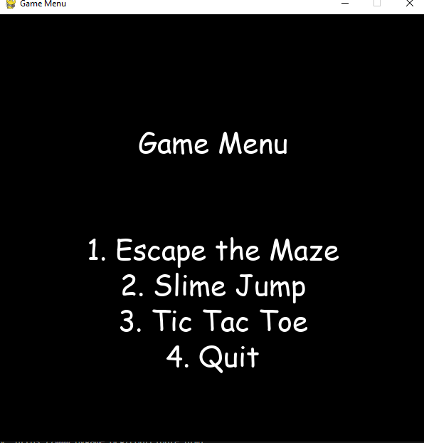

# Game Menu

This is a simple Python game application that provides a menu for multiple games. The games included are:

1. **Escape the Maze**: A maze game where you control a player to escape a randomly generated maze.
2. **Slime Jump**: A platformer game where you control a slime to jump on platforms while avoiding obstacles.
3. **Tic-Tac-Toe**: A classic two-player game where you place marks on a 3x3 grid to achieve a row, column, or diagonal of three matching marks.

The game is built using **Python** and the **Pygame** library.

## Demo Video

Watch the demo of the game in action:

[](assets/screen-capture.webm)


## Requirements

- Python 3.x
- Pygame library

To install Pygame, you can use pip:

```bash
pip install pygame
```
Game Features
1. Escape the Maze
Navigate through a randomly generated maze.
Collect collectibles while avoiding obstacles.
Escape the maze to win!
2. Slime Jump
Control a slime character that can jump on moving platforms.
Avoid falling or hitting obstacles.
A cooldown system for jumping makes the game more challenging.
3. Tic-Tac-Toe
Classic Tic-Tac-Toe game where two players take turns marking X's and O's.
The game ends when a player wins or there is a draw.
How to Run
To play the game, simply run the main_menu.py file.

```bash
python main_menu.py
```
The game will present a menu with four options:

Escape the Maze
Slime Jump
Tic-Tac-Toe
Quit
Select a game by pressing the corresponding number key (1, 2, or 3). To quit the application, press 4.

Game Controls
- Escape the Maze: Arrow keys to move.
- Slime Jump: Arrow keys to move left or right, spacebar to jump.
- Tic-Tac-Toe: Click on the grid to place your mark (X or O).
## Acknowledgments
This project was developed by ChatGPT.

License
This project is open-source and available under the MIT License.


### Key Details:
- **Game Features**: A brief description of each game is provided.
- **How to Run**: Instructions to run the game.
- **Controls**: A description of how to interact with each game.
- **Acknowledgments**: Credits to ChatGPT for the project development. 

You can customize it further based on any additional features or changes you've made to the game.